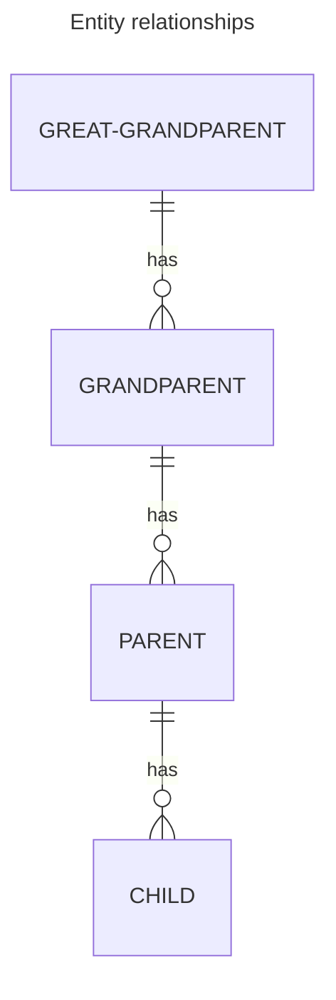

## Backstory

The application I'm primarily working on at work at the moment is
a fairly typical web app. The primary page that users start on is
a large table of data related to things that they need to work on.
We started getting actual users towards the end of last year, and
while the user set was initially small, the actual data set we were
working with was quite large. This is because we were migrating
users over from a legacy web app onto our new one, and we needed
relevant data for all users, so that as they onboard they could
immediately use our new app.

Generally this worked pretty well. However, we started noticing that
occassionally, instead of getting a response in less than 5 seconds
(typically less than one), there was sometimes wait times of up to
a minute. This obviously lead to a bad user experience and was
something that we wanted to solve, so my team started looking into
what the root cause might be. Interestingly, it did not seem to be
predictable based on the amount of data the user was working with -
our first customer had a lot of data and was consistently getting
fast responses, while others with much smaller data sets were sometimes
waiting 45 seconds instead of <1 second.

## The Investigation Begins

Here is what the data looked like at a high level; there were four
layers of data specificity:

> A note here: I am currently waiting on a
> [pull request](https://github.com/JulianCataldo/web-garden/pull/89)
> to be merged in the astro-diagram package in order for this mermaid
> chart to be rendered correctly. But if you'd like, you can paste
> the code into [the Mermaid playground](https://mermaid.live/) to see
> what it looks like.



When investigating performance issues in queries, my mind always
jumps to indexes. As such I began by insuring that all of the columns
used in the joins and `WHERE` clause had appropriate indexes on them -
which they did. Complicating my investigation was the fact that the table
we were querying was actually a partitioned table - we'll call those
partitions "new" and "legacy." Despite that, all of the data we were
querying actually only existed in the "legacy" tables - and we were
specifying that in how we filtered the results. The Postgres `EXPLAIN`
tool helped to confirm that as well - it's very helpful that it shows
the actual entities being queried!

Just to be doubly sure, I switched everything over to the underlying
partition that I believed I was querying. The results were exactly the same.
The query was generally pretty fast, but would occassionally hit a pretty
big slowdown. At this point I didn't have much to go off of, but I did
add an alarm to DataDog so that I knew when we were having issues.

## And It Continues...

I would occassionally look at what was going on when I saw the alert
triggered, but there didn't seem to be much of a pattern to it. I asked
for help from folks experienced in Postgres' ways and had some great
pairing sessions with some of my colleagues on other teams (huge shoutout
to them!). During one of these sessions, we could clearly see as I had
before that on a random table in the tree, it seemed like the indexes
would stop being used and revert to a sequence scan, despite being present
on all necessary columns - as well as the foreign key (FK) relationships
existing too.

As an experiment, we set `ENABLE_SEQSCAN=off` in our session, which is
a Postgres configuration option. From my understanding it essentially sets
the cost of a sequential scan to an extremely high number, which encourages
the Postgres query planner from using them. With this configuration change,
the query performed well in all cases - which went to show that the correct
indexes _were_ in place, and quite honestly only confused me more. The
option of setting this config option every time before running the
problematic query and then turning it back on was discussed - but because it
is a global config setting, the potential blast radius was pretty large, and
we decided against it.

## Finally, a Resolution

Eventually, we were getting more and more customers on our system which was
causing our alarm to go off more often, and more customers to have a bad
experience. Out of desperation, I decided to rebuild the query table-by-table
and try to pinpoint exactly what might be going wrong, with a lot of testing
at each step. After doing this for a while I happened to notice an oddity
with the `ON` clauses in the joins. The data wasn't totally normalized, and
the `grandparent` table was being joined by using its id (which was foreign
keyed) on the `child` table, skipping over the `parent` table, so it looked
something like this:

```sql
FROM child c
JOIN parent p ON p.id = c.parent_id
JOIN grandparent gp ON gp.id = c.grandparent_id
```

This seemed innocuous, but adding `AND p.grandparent_id = gp.id` to that join
fixed the performance in all test cases! It seems that somehow not joining
the hierarchy together in a normal way - even though the data result was
exactly the same, and everything was still joined on a foreign key - was
confusing the query planner into thinking that a sequential scan would be
more efficient. This seems to have something to do with why I was seeing
varying results depending on how many child records were being selected;
the query planner was making optimization decisions that depended on that.

## The Takeaways

So, what's the takeaway here? I think my case was pretty specific, and
probably not directly applicable to most people. But despite being a
relatively frustrating journey - all to be fixed with a single line in an
`ON` clause - there was some good that came of it:

- I asked and received some excellent help from colleagues outside my team
  that I don't normally get to interact with, and now have better
  relationships with them
- I got more experience with Postgres' `ANALYZE` tools; I had mostly used
  the comparable tools in Oracle before, and this is a skill that will
  continue to be valuable moving forward
- The next time I'm troubleshooting a problematic query, I'm going still
  going to look at indexes first. But, if they aren't being utilized as
  I would expect, I'm going to pay very close attention to the `FROM`
  and `WHERE` portions of the query!

Thanks for reading, I hope it was helpful!
